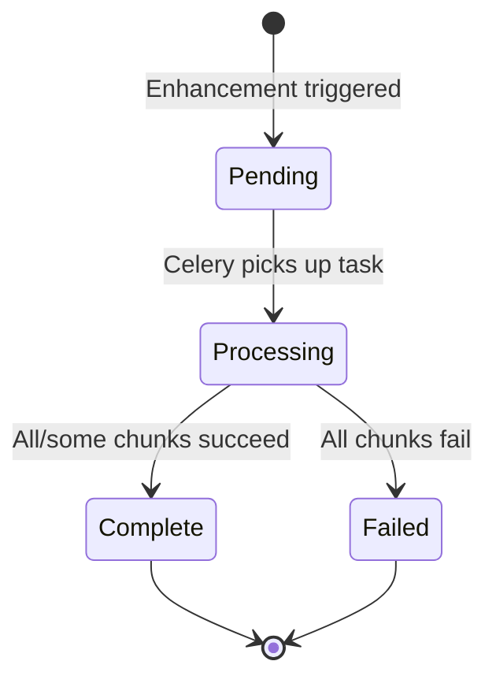

# Business Logic Documentation

This document explains the business purpose, user workflows, and design principles of the DEMAS (Data Enhancement Multi-Agent System) application.

## 1. Application Purpose

### 1.1 Primary Goal

**Make data cleanup and enhancement generic and easy for regular users.**

DEMAS is designed to democratize data preparation by allowing non-technical users to clean, enrich, and transform datasets without writing code or understanding complex data processing pipelines.

### 1.2 Target Users

| User Type | Use Case |
|-----------|----------|
| **Business Analysts** | Clean exported reports, fill missing customer data |
| **Marketers** | Enrich lead lists with company information |
| **Researchers** | Standardize survey data, add contextual information |
| **Data Entry Staff** | Correct inconsistencies, validate data quality |
| **Small Business Owners** | Prepare data for import into other systems |

### 1.3 Core Use Cases

1. **Clean inconsistent data** - Fix capitalization, formatting, terminology
2. **Fill missing values** - Research-based enrichment using web search
3. **Add new fields** - Calculate or research additional data points
4. **Standardize formats** - Unify date formats, category names, conventions
5. **Validate data quality** - Ensure data meets target schema requirements

---

## 2. Data Enhancement Workflow

### 2.1 User Journey Overview


### 2.2 Step 1: Upload Data

**User Actions**:
- Navigate to upload page
- Select CSV or JSON file
- Preview parsed data in table format

**System Behavior**:
- Parses file format
- Displays data preview
- Infers initial schema (field names and types)
- Stores as `OriginalData` record

**Supported Formats**:
| Format | Structure |
|--------|-----------|
| CSV | Comma-separated with headers |
| JSON | Array of objects |

### 2.3 Step 2: Define Schema

**User Actions**:
- Review inferred field types
- Edit field names if needed
- Modify field types (string, integer, float, boolean)
- Add descriptions to guide enhancement
- Add new fields not present in original data

**Schema Editor Features**:
- Field name editing
- Type dropdown selection
- Description text input
- Add/remove fields
- Field reordering

**Example Schema Definition**:
```json
{
  "id": {
    "type": "int",
    "description": "Unique company identifier"
  },
  "company_name": {
    "type": "str",
    "description": "Official company name in Title Case"
  },
  "industry": {
    "type": "str",
    "description": "Industry category (e.g., AI, Finance, Healthcare)"
  },
  "ceo": {
    "type": "str",
    "description": "Current CEO name"
  },
  "founded_year": {
    "type": "int",
    "description": "Year the company was founded"
  },
  "company_age": {
    "type": "int",
    "description": "Age of company calculated from founded year"
  }
}
```

### 2.4 Step 3: Trigger Enhancement

**User Actions**:
- Click "Enhance Data" button
- Wait for processing confirmation

**System Behavior**:
1. Creates `EnhancedData` record with `status="pending"`
2. Dispatches asynchronous Celery task
3. Returns immediately with pending status
4. Chunks data (10 records per chunk)
5. Processes chunks in parallel

### 2.5 Step 4: Processing (Background)

**What Happens**:
- Multi-agent system processes each data chunk
- Supervisor orchestrates cleaning and enrichment
- Enhancer modifies data and researches missing values
- Reviewer validates modifications
- Composer formats output to match schema

**Processing Time**:
- Depends on data size and complexity
- Typically 30 seconds to several minutes
- Progress tracked via status polling

### 2.6 Step 5: View Results

**User Actions**:
- Poll/refresh to check status
- View enhanced data in table format
- Compare with original data
- Review schema compliance

**Display Features**:
- Side-by-side comparison (original vs enhanced)
- Schema displayed in readonly mode
- Data table with pagination
- Status indicator (pending/complete/failed)

### 2.7 Step 6: Export

**User Actions**:
- Click export button
- Download enhanced data as CSV

**Export Options**:
- CSV format (default)
- Full dataset download

---

## 3. Enhancement Capabilities

### 3.1 Data Cleaning

| Capability | Example |
|------------|---------|
| **Capitalization** | "OPENAI" → "OpenAI" |
| **Terminology Standardization** | "ML", "A.I.", "Machine Learning" → "AI" |
| **Formatting** | Remove extra whitespace, fix punctuation |
| **Duplicate Handling** | Identify and flag duplicates |
| **Type Conversion** | "123" (string) → 123 (integer) |

### 3.2 Data Enrichment

| Capability | Example |
|------------|---------|
| **Missing Value Research** | Empty CEO field → Research and fill "Sam Altman" |
| **Web Search Integration** | Look up company information via Tavily |
| **Calculated Fields** | `age = current_year - founded_year` |
| **Cross-Reference Data** | Match company name to find HQ location |

### 3.3 Data Validation

| Capability | Description |
|------------|-------------|
| **Type Validation** | Ensure integers are integers, not strings |
| **Schema Compliance** | Verify all required fields present |
| **Null Handling** | Replace nulls with researched values |
| **Plausibility Checks** | Flag suspicious enriched values |

---

## 4. Enhancement Examples

### 4.1 Example: Tech Company Data

**Original Data (CSV)**:
```csv
id,company_name,industry,ceo,founded_year
1,openAI,Artificial Intelligence,,2015
2,ANTHROPIC,ML,Dario Amodei,2021
3,google,Search,,1998
```

**Schema Definition**:
```json
{
  "id": {"type": "int", "description": "Company ID"},
  "company_name": {"type": "str", "description": "Company name in Title Case"},
  "industry": {"type": "str", "description": "Industry, standardized to 'AI', 'Search', etc."},
  "ceo": {"type": "str", "description": "Current CEO name"},
  "founded_year": {"type": "int", "description": "Year founded"},
  "company_age": {"type": "int", "description": "Age of company in years"}
}
```

**Enhanced Output**:
```json
[
  {
    "id": 1,
    "company_name": "OpenAI",
    "industry": "AI",
    "ceo": "Sam Altman",
    "founded_year": 2015,
    "company_age": 10
  },
  {
    "id": 2,
    "company_name": "Anthropic",
    "industry": "AI",
    "ceo": "Dario Amodei",
    "founded_year": 2021,
    "company_age": 4
  },
  {
    "id": 3,
    "company_name": "Google",
    "industry": "Search",
    "ceo": "Sundar Pichai",
    "founded_year": 1998,
    "company_age": 27
  }
]
```

### 4.2 Transformations Applied

| Field | Transformation |
|-------|----------------|
| `company_name` | Fixed capitalization (Title Case) |
| `industry` | Standardized "Artificial Intelligence", "ML" → "AI" |
| `ceo` | Researched missing values via web search |
| `company_age` | Calculated: `2025 - founded_year` |

---

## 5. Generic Design Principles

### 5.1 Schema-Driven Architecture

**No Hardcoded Data Structures**:
- User defines output format
- System adapts to any data shape
- Dynamic Pydantic model generation at runtime

**Benefits**:
- Works with any dataset type
- No code changes needed for new data formats
- User-controlled output structure

### 5.2 Flexible Input Handling

| Feature | Description |
|---------|-------------|
| **Format Agnostic** | Supports CSV and JSON |
| **Structure Flexible** | Handles inconsistent row structures |
| **Type Inference** | Automatically detects field types |
| **Error Tolerant** | Graceful handling of malformed data |

### 5.3 Extensible Agent System

**Easy to Add New Capabilities**:
- Add new agent nodes to graph
- Integrate additional tools (beyond Tavily)
- Swap LLM providers (OpenAI, Anthropic, etc.)
- Add specialized enhancement agents

**Current Tool Integration**:
| Tool | Purpose |
|------|---------|
| TavilySearch | Web research for missing data |

**Potential Extensions**:
- Database lookup tools
- API integrations (CRM, ERP)
- Document parsing tools
- Image analysis tools

### 5.4 Model-Agnostic Design

**LLM Provider Flexibility**:
- Currently uses Google Gemini
- Can switch to OpenAI, Anthropic, etc.
- Model names configurable via environment
- LangChain abstraction layer

---

## 6. Business Rules

### 6.1 Data Integrity Rules

| Rule | Implementation |
|------|----------------|
| **Preserve Original** | Original data never modified |
| **No Unsolicited Additions** | Only add fields defined in schema |
| **Research Before Hallucinate** | Use web search before inventing data |
| **Null Over False Data** | Return null if data cannot be found |

### 6.2 Processing Rules

| Rule | Implementation |
|------|----------------|
| **Chunk Size** | 10 records per chunk |
| **Max Revisions** | 1 revision cycle allowed |
| **Best Effort** | Partial success saved (not all-or-nothing) |
| **Parallel Processing** | Chunks processed concurrently |

### 6.3 Quality Assurance

| Check | Agent Responsible |
|-------|-------------------|
| Completeness | Reviewer |
| Data Integrity | Reviewer |
| Hallucination Detection | Reviewer |
| Format Compliance | Reviewer + Composer |
| Schema Validation | Composer |

---

## 7. Status Lifecycle



### 7.1 Status Definitions

| Status | Description |
|--------|-------------|
| `pending` | Enhancement requested, waiting for processing |
| `complete` | Enhancement finished (may have partial results) |
| `failed` | All chunks failed, no usable data |

---

## 8. Error Handling

### 8.1 User-Facing Errors

| Scenario | User Message |
|----------|--------------|
| Empty data | "OriginalData contains no data" |
| Invalid schema | "schema must be a dictionary/object" |
| Data not found | "OriginalData with id X not found" |
| All chunks fail | Status changes to "failed" |

### 8.2 Graceful Degradation

- Partial results saved if some chunks succeed
- Failed chunks logged with error details
- Original data always preserved for retry

---

## 9. Security Considerations

### 9.1 Data Handling

| Consideration | Implementation |
|---------------|----------------|
| **Data Privacy** | Data processed server-side only |
| **No External Storage** | Enhanced data stays in user's database |
| **Web Search** | Only uses public information |
| **API Security** | CSRF protection, CORS configuration |

### 9.2 API Keys

| Key | Purpose | Storage |
|-----|---------|---------|
| `GOOGLE_API_KEY` | Gemini LLM access | Environment variable |
| `TAVILY_API_KEY` | Web search access | Environment variable |

---

## 10. Future Enhancements

### 10.1 Planned Features

| Feature | Description |
|---------|-------------|
| **Template Schemas** | Pre-built schemas for common data types |
| **Enhancement History** | Track changes across multiple enhancements |
| **Batch Processing** | Multiple files in single operation |
| **Scheduled Enhancements** | Automated periodic data refresh |
| **Custom Prompts** | User-defined enhancement instructions |

### 10.2 Potential Integrations

| Integration | Use Case |
|-------------|----------|
| **CRM Systems** | Enrich customer data automatically |
| **Spreadsheet Apps** | Direct import/export to Google Sheets, Excel |
| **Database Connectors** | Direct database import/export |
| **Webhook Notifications** | Alert when enhancement completes |
