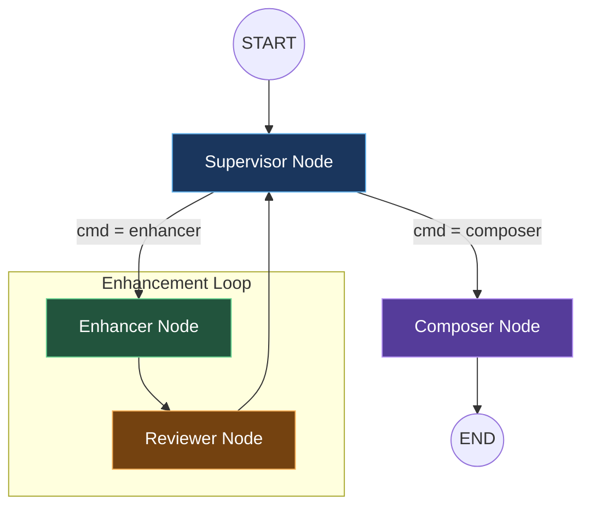
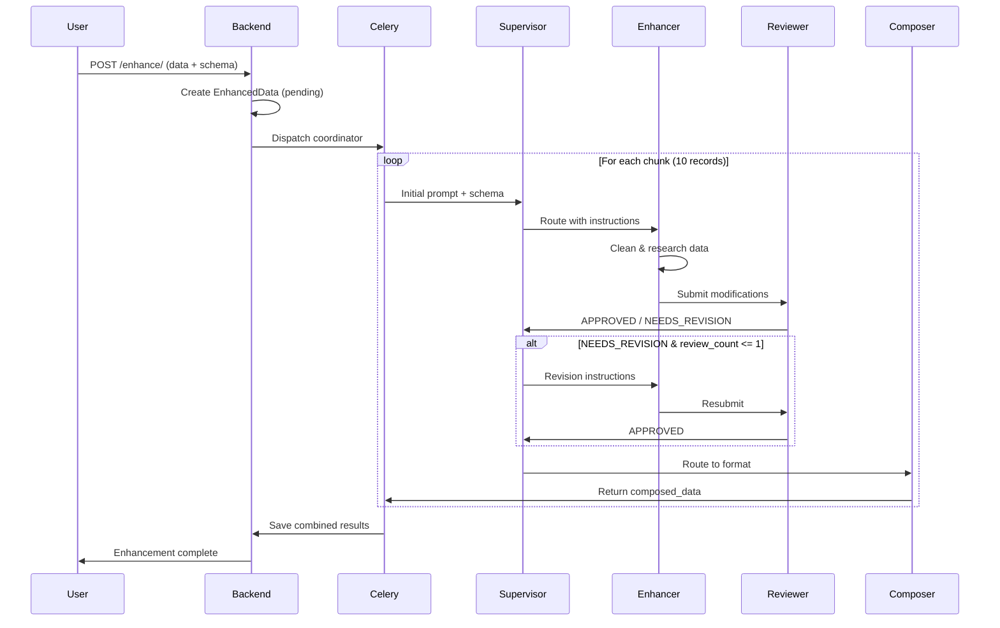
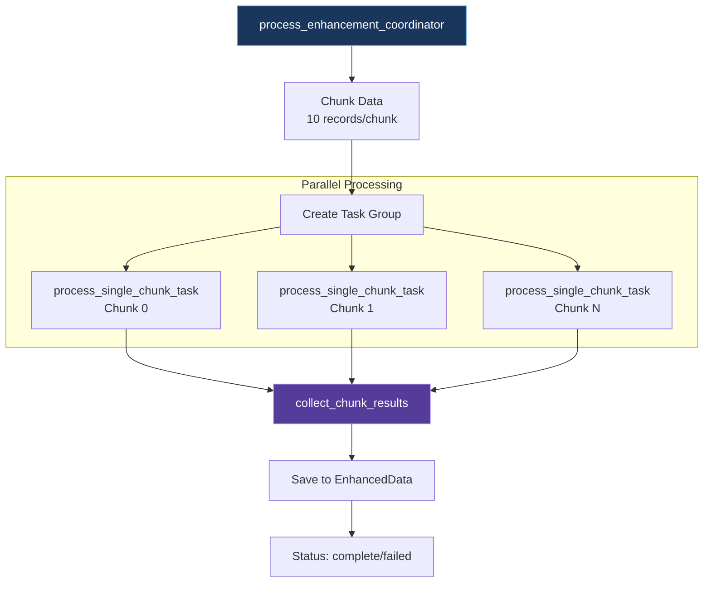

# Enhancement Graph Documentation

This document details the LangGraph multi-agent system that powers the data enhancement workflow.

## 1. Graph Architecture Overview

The enhancement system is built as a **LangGraph state machine** with 4 agent nodes that collaborate to clean, enrich, validate, and format data.

### 1.1 State Definition

```python
class MessagesState(TypedDict):
    messages: Annotated[list[AnyMessage], operator.add]  # Conversation history
    llm_calls: int                                        # LLM call counter
    cmd: Literal["composer", "data_chunk_supervisor", "end"]  # Routing command
    enhanced_data: list[dict | str | int | float | bool | None]  # Modified data
    composed_data: list[dict | str | int | float | bool | None]  # Final output
    review_count: int                                     # Review iteration count
    schema: dict[str, str]                                # Target output schema
```

### 1.2 Key State Fields

| Field | Type | Purpose |
|-------|------|---------|
| `messages` | `list[AnyMessage]` | Accumulating conversation history between agents |
| `cmd` | `Literal` | Routing decision from Supervisor |
| `enhanced_data` | `list` | Data after Enhancer modifications |
| `composed_data` | `list` | Final formatted data from Composer |
| `review_count` | `int` | Tracks review iterations (max 1 revision) |
| `schema` | `dict` | User-defined target output schema |

---

## 2. Node Visualization

### 2.1 Graph Flow Diagram



### 2.2 Edge Definitions

```python
# Graph construction
graph = StateGraph(MessagesState)

# Add nodes
graph.add_node("supervisor", supervisor_node)
graph.add_node("enhancer", enhancer_node)
graph.add_node("reviewer", reviewer_node)
graph.add_node("composer", composer_node)

# Define edges
graph.add_edge(START, "supervisor")
graph.add_conditional_edges("supervisor", supervisor_routing, {
    "composer": "composer",
    "enhancer": "enhancer"
})
graph.add_edge("enhancer", "reviewer")
graph.add_edge("reviewer", "supervisor")
graph.add_edge("composer", END)
```

---

## 3. Node Details

### 3.1 Supervisor Node

**Location**: `graph/agents/supervisor.py`

**Role**: Orchestrates workflow between Enhancer and Composer based on review status.

**Input**:
- Last message from Reviewer
- `review_count` from state

**Decision Logic**:

```
IF status = "APPROVED" OR review_count > 1:
    → Route to Composer
ELSE IF status = "NEEDS_REVISION" OR first message:
    → Route to Enhancer with instructions
```

**Output Schema**:

```python
class SupervisorResponse(BaseModel):
    response: str = Field(description="Reasoning for the routing decision")
    cmd: Literal["composer", "enhancer"] = Field(description="Next agent to route to")
```

**LLM Configuration**:
- Model: Google Gemini (configurable via `supervisor_model_name`)
- Temperature: 0 (deterministic)
- Structured output via Pydantic

---

### 3.2 Enhancer Node

**Location**: `graph/agents/enhancer.py`

**Role**: Modifies, cleans, and enriches data using web search capabilities.

**Tools Available**:

| Tool | Configuration | Purpose |
|------|---------------|---------|
| `TavilySearch` | `max_results=5`, `topic="general"` | Web research for missing data |

**Input**:
- Supervisor instructions
- Original/current data from messages

**Process**:
1. Receives instructions from Supervisor
2. Analyzes data for cleaning needs
3. Uses TavilySearch to research missing values
4. Modifies dataset according to instructions
5. Returns enhanced data

**Agent Architecture**:
- Uses `create_tool_calling_agent` from LangChain
- Wrapped in `AgentExecutor` for tool execution
- Verbose mode enabled for debugging

**Output**:
- Enhanced data as message content
- Stores in `enhanced_data` state field

---

### 3.3 Reviewer Node

**Location**: `graph/agents/reviewer.py`

**Role**: Quality auditor that validates Enhancer's modifications.

**Audit Checklist**:

| Check | Description |
|-------|-------------|
| **Completeness** | Did the Enhancer do what was asked? |
| **Integrity** | Are there new NULL values where there shouldn't be? |
| **Hallucination** | If data was enriched, does it look plausible? |
| **Formatting** | Are column names clean and consistent? |

**Output Schema**:

```python
class ReviewerResponse(BaseModel):
    status: Literal["APPROVED", "NEEDS_REVISION"] = Field(
        description="Whether the data modifications are approved or need revision"
    )
    reasoning: str = Field(description="Explanation of the review decision")
```

**State Updates**:
- Appends review message to `messages`
- Increments `review_count`

---

### 3.4 Composer Node

**Location**: `graph/agents/composer.py`

**Role**: Formats final data according to user-defined schema using dynamic Pydantic validation.

**Input**:
- `enhanced_data` from state
- `schema` dictionary defining target structure

**Process**:
1. Builds dynamic Pydantic model from schema
2. Wraps model in list response wrapper
3. Formats enhanced data to match schema
4. Validates output structure
5. Returns composed data

**Dynamic Model Creation**:

```python
DynamicDataModel = build_dynamic_model(schema_dict, "ComposerResponse")

class ComposerResponseWrapper(BaseModel):
    composed_data: list[DynamicDataModel] = Field(
        description="The final formatted dataset as a list of record dictionaries"
    )
```

**Output**:
- Structured `composed_data` matching target schema
- Each record validated against dynamic Pydantic model

---

## 4. Communication Flow

### 4.1 Enhancement Request Sequence



### 4.2 State Transitions

| Stage | State Changes |
|-------|---------------|
| **Initial** | `messages=[prompt]`, `review_count=0`, `schema={...}` |
| **After Supervisor** | `cmd="enhancer"` or `cmd="composer"` |
| **After Enhancer** | `enhanced_data=[...]`, new message added |
| **After Reviewer** | `review_count++`, status message added |
| **After Composer** | `composed_data=[...]`, final message added |

---

## 5. Dynamic Type Builder

**Location**: `graph/output_formats.py`

### 5.1 Purpose

Creates Pydantic models at runtime based on user-defined schema, enabling flexible output validation without hardcoded data structures.

### 5.2 Schema Format

```python
schema = {
    "field_name": {
        "type": "int" | "str" | "bool" | "float" | "str | null",
        "description": "Field description for LLM context"
    }
}
```

### 5.3 Example Usage

```python
schema = {
    "id": {"type": "int", "description": "User ID"},
    "name": {"type": "str", "description": "User name"},
    "age": {"type": "int | null", "description": "User age (optional)"}
}

Model = build_dynamic_model(schema, "UserModel")
# Creates: class UserModel(BaseModel): id: int, name: str, age: Optional[int]
```

### 5.4 Key Functions

| Function | Purpose |
|----------|---------|
| `_parse_type(type_spec)` | Converts string types to Python types |
| `build_dynamic_model(schema, model_name)` | Creates Pydantic BaseModel dynamically |

### 5.5 Type Mapping

| String Type | Python Type |
|-------------|-------------|
| `"str"` | `str` |
| `"int"` | `int` |
| `"float"` | `float` |
| `"bool"` | `bool` |
| `"str \| null"` | `Optional[str]` |
| `"int \| null"` | `Optional[int]` |

### 5.6 Model Caching

Models are cached by schema signature to avoid redundant creation:

```python
_model_cache: dict[str, type[BaseModel]] = {}

# Cache key format: "ModelName:(sorted schema items)"
cache_key = f"{model_name}:{str(schema_items)}"
```

---

## 6. Redis and Celery in Data Enhancement

### 6.1 Redis Role

| Function | Description |
|----------|-------------|
| **Message Broker** | Queues Celery tasks for workers |
| **Result Backend** | Stores task results for retrieval |
| **Configuration** | `CELERY_BROKER_URL=redis://redis:6379/0` |

### 6.2 Celery Role

| Function | Description |
|----------|-------------|
| **Async Processing** | Handles long-running enhancement tasks |
| **Parallel Chunks** | Processes data chunks concurrently |
| **Task Coordination** | Uses group/chord pattern for aggregation |

### 6.3 Task Architecture



### 6.4 Task Definitions

#### `process_enhancement_coordinator`

Main coordinator that chunks data and dispatches parallel tasks:

```python
@shared_task
def process_enhancement_coordinator(enhanced_data_id, original_data_list, schema_dict):
    # Chunk data (10 records per chunk)
    chunked_data = CsvChunker(original_data_list, 10).chunk()
    
    # Create parallel task group
    chunk_tasks = group(
        process_single_chunk_task.s(chunk, chunk_index, schema_dict)
        for chunk_index, chunk in enumerate(chunked_data)
    )
    
    # Use chord to run collector after all complete
    chord(chunk_tasks)(collect_chunk_results.s(enhanced_data_id, total_chunks))
```

#### `process_single_chunk_task`

Processes one data chunk through the full graph:

```python
@shared_task
def process_single_chunk_task(chunk, chunk_index, schema_dict):
    # Compile graph (thread-safe)
    graph = StateGraph(MessagesState)
    # ... add nodes and edges ...
    compiled_graph = graph.compile()
    
    # Invoke with prompt and schema
    result = compiled_graph.invoke({
        "messages": [HumanMessage(prompt)],
        "review_count": 0,
        "schema": schema_dict,
    })
    
    return {"chunk_index": chunk_index, "success": True, "data": result["composed_data"]}
```

#### `collect_chunk_results`

Aggregates results from all chunks:

```python
@shared_task
def collect_chunk_results(chunk_results, enhanced_data_id, total_chunks):
    # Sort by chunk_index to maintain order
    sorted_results = sorted(chunk_results, key=lambda x: x.get("chunk_index", 0))
    
    # Combine successful chunks (Best Effort Strategy)
    combined_enhanced_data = []
    for result in sorted_results:
        if result.get("success") and result.get("data"):
            combined_enhanced_data.extend(result["data"])
    
    # Save results
    enhanced_data_obj.data = combined_enhanced_data
    enhanced_data_obj.status = "complete" if combined_enhanced_data else "failed"
    enhanced_data_obj.save()
```

### 6.5 Why Asynchronous Processing?

| Reason | Explanation |
|--------|-------------|
| **Long Duration** | Enhancement can take minutes (LLM calls, web searches) |
| **HTTP Timeout** | Prevents request timeout errors |
| **Parallel Processing** | Multiple chunks processed concurrently |
| **Non-blocking** | API returns immediately with pending status |
| **Scalability** | Workers can be scaled horizontally |

### 6.6 Error Handling Strategy

**Best Effort (Strategy C)**: 
- Saves all successful chunks
- Only fails if ALL chunks fail
- Reports partial success with chunk success/failure counts

```python
if not combined_enhanced_data:
    enhanced_data_obj.status = "failed"
else:
    enhanced_data_obj.data = combined_enhanced_data
    enhanced_data_obj.status = "complete"
```

---

## 7. LLM Configuration

**Location**: `graph/models.py`

All agents use Google Gemini models configured via environment variables:

| Agent | Model Variable | Temperature |
|-------|----------------|-------------|
| Supervisor | `supervisor_model_name` | 0 |
| Enhancer | `enhancer_model_name` | 0 |
| Reviewer | `reviewer_model_name` | 0 |
| Composer | `composer_model_name` | 0 |

All models use `temperature=0` for deterministic, consistent outputs.
