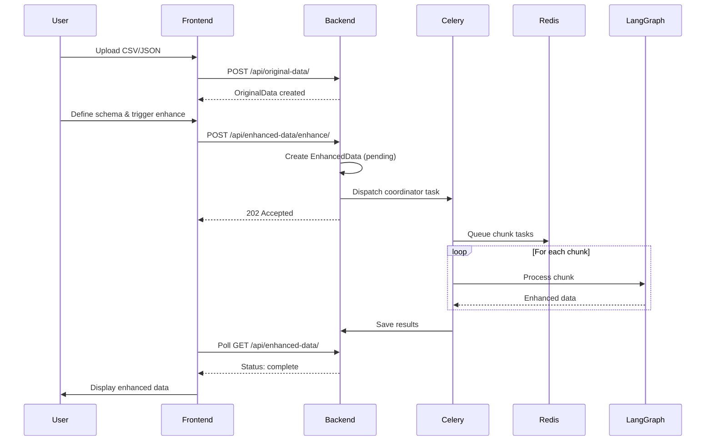
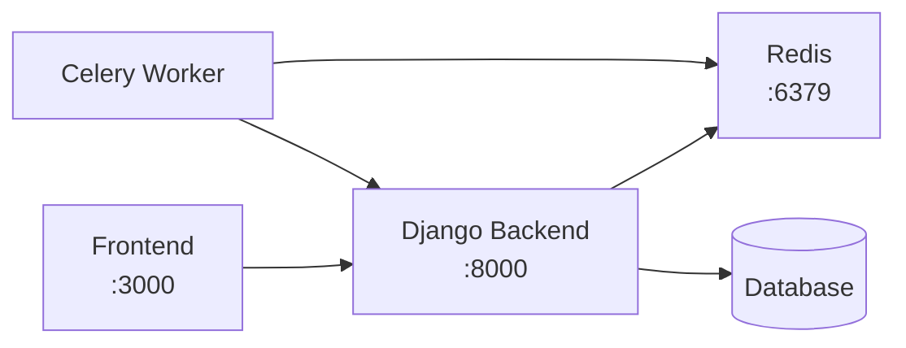

# Technical Documentation

This document provides comprehensive technical details about the DEMAS (Data Enhancement Multi-Agent System) project architecture, technologies, and communication patterns.

## 1. Project Structure

### 1.1 Root Structure

```
demas-multiagent-system/
├── frontend/              # Next.js React application
├── graph/                 # LangGraph multi-agent system
├── main/                  # Django REST Framework backend
├── models/                # Django database models
├── docker-compose.yaml    # Service orchestration
├── dockerfile             # Container build configuration
├── settings.py            # Django configuration
├── manage.py              # Django management script
├── pyproject.toml         # Python dependencies (uv)
└── justfile               # Task runner commands
```

### 1.2 Frontend Structure (`frontend/`)

```
frontend/
├── app/                   # Next.js App Router
│   ├── data/              # Data routes
│   ├── data-detail/       # Schema editor and data detail components
│   ├── data-overview/     # Data listing pages
│   ├── data-preview/      # Data table preview component
│   ├── data-upload-form/  # File upload and parsing logic
│   ├── layout.tsx         # Root layout
│   ├── page.tsx           # Home page
│   └── globals.css        # Global styles
├── api/                   # API client layer
│   ├── api.ts             # API utilities
│   ├── apiClient.ts       # openapi-fetch client instance
│   ├── queries.ts         # TanStack Query key factory
│   └── schema.d.ts        # Auto-generated TypeScript types
├── components/            # Reusable UI components (shadcn/ui)
├── lib/                   # Utility functions
└── public/                # Static assets
```

### 1.3 Backend Structure (`main/`)

```
main/
├── views/                 # API viewset implementations
│   ├── original_data.py   # OriginalData CRUD endpoints
│   └── enhanced_data.py   # EnhancedData endpoints + enhance action
├── migrations/            # Database migrations
├── celery.py              # Celery app configuration
├── tasks.py               # Celery task definitions
├── serializers.py         # DRF serializers
├── urls.py                # URL routing
├── models.py              # Model imports
└── admin.py               # Django admin configuration
```

### 1.4 Graph Structure (`graph/`)

```
graph/
├── agents/                # Individual agent nodes
│   ├── supervisor.py      # Workflow orchestrator
│   ├── enhancer.py        # Data modification agent
│   ├── reviewer.py        # Quality auditor
│   └── composer.py        # Output formatter
├── main.py                # Graph orchestration (development/testing)
├── states.py              # LangGraph state definition
├── output_formats.py      # Dynamic Pydantic model builder
├── models.py              # LLM model configuration
└── utils.py               # Utility functions (CsvChunker, etc.)
```

### 1.5 Models Structure (`models/`)

```
models/
├── original_data.py       # OriginalData model (data, schema fields)
└── enhanced_data.py       # EnhancedData model (data, status, FK to OriginalData)
```

---

## 2. Technologies Used

### 2.1 Frontend Stack

| Technology | Version | Purpose |
|------------|---------|---------|
| **Next.js** | 16.1.1 | React framework with App Router |
| **React** | 19.2.3 | UI library |
| **TypeScript** | 5.x | Type safety |
| **Tailwind CSS** | 4.x | Utility-first styling |
| **shadcn/ui** | - | Component library |
| **TanStack Query** | 5.90.16 | Data fetching and caching |
| **openapi-fetch** | 0.15.0 | Type-safe API client |
| **query-key-factory** | 1.3.4 | Query key management |
| **js-cookie** | 3.0.5 | Cookie handling (CSRF) |

### 2.2 Backend Stack

| Technology | Version | Purpose |
|------------|---------|---------|
| **Django** | 5.2.5 | Web framework |
| **Django REST Framework** | 3.15.2 | API layer |
| **drf-spectacular** | 0.28.0 | OpenAPI schema generation |
| **Celery** | 5.6.2 | Asynchronous task queue |
| **Redis** | 7 (Alpine) | Message broker and result backend |
| **PostgreSQL** | - | Production database |
| **SQLite** | - | Development fallback |
| **dj-database-url** | 3.0.1 | Database URL parsing |
| **Gunicorn** | 23.0.0 | Production WSGI server |

### 2.3 AI/ML Stack

| Technology | Version | Purpose |
|------------|---------|---------|
| **LangGraph** | 0.6.7 | Multi-agent orchestration |
| **LangChain** | 0.3.27 | LLM framework |
| **langchain-google-genai** | 2.1.10 | Google Gemini integration |
| **langchain-tavily** | 0.2.16 | Web search tool |
| **Pydantic** | - | Data validation and dynamic model creation |
| **google-genai** | 1.36.0 | Google AI SDK |

### 2.4 DevOps Stack

| Technology | Purpose |
|------------|---------|
| **Docker** | Containerization |
| **Docker Compose** | Multi-container orchestration |
| **uv** | Fast Python package manager |

---

## 3. Frontend/Backend Communication

### 3.1 API Architecture

- **Protocol**: RESTful API with OpenAPI/Swagger documentation
- **Base URL**: `http://localhost:8000/api/` (development)
- **Documentation**: Available at `/api/docs/` (Swagger UI) and `/api/schema/redoc/` (ReDoc)
- **Schema**: Auto-generated TypeScript types from OpenAPI schema (`frontend/api/schema.d.ts`)

### 3.2 Key Endpoints

| Method | Endpoint | Description |
|--------|----------|-------------|
| `GET` | `/api/original-data/` | List all original data |
| `GET` | `/api/original-data/{id}/` | Get specific original data |
| `POST` | `/api/original-data/` | Upload new data |
| `GET` | `/api/enhanced-data/` | List all enhanced data |
| `GET` | `/api/enhanced-data/{id}/` | Get specific enhanced data |
| `POST` | `/api/enhanced-data/enhance/` | Trigger enhancement |
| `DELETE` | `/api/enhanced-data/{id}/` | Delete enhanced data |

### 3.3 Data Flow



### 3.4 Authentication & Security

- **CSRF Protection**: Token-based via cookies using `js-cookie`
- **CORS**: Enabled for frontend origin via `django-cors-headers`
- **Session**: Django session-based authentication (configurable)

### 3.5 Type Safety

The frontend uses auto-generated TypeScript types from the OpenAPI schema:

```typescript
// frontend/api/apiClient.ts
import createClient from "openapi-fetch";
import type { paths } from "./schema";

const client = createClient<paths>({ baseUrl: "http://localhost:8000" });
```

---

## 4. Database Models

### 4.1 OriginalData

```python
class OriginalData(models.Model):
    data = models.JSONField(default=list)           # Raw uploaded data
    schema = models.JSONField(default=dict)         # Field type definitions
    created_at = models.DateTimeField(auto_now_add=True)
    updated_at = models.DateTimeField(auto_now=True)
```

### 4.2 EnhancedData

```python
class EnhancedData(models.Model):
    STATUS_CHOICES = [
        ("pending", "Pending"),
        ("complete", "Complete"),
        ("failed", "Failed"),
    ]
    
    data = models.JSONField(default=list)           # Enhanced data result
    status = models.CharField(max_length=20, default="pending")
    created_at = models.DateTimeField(auto_now_add=True)
    updated_at = models.DateTimeField(auto_now=True)
    original_data = models.ForeignKey(OriginalData, on_delete=models.CASCADE)
```

---

## 5. Service Architecture

### 5.1 Docker Compose Services

```yaml
services:
  redis:           # Message broker (port 6379)
  django-backend:  # API server (port 8000)
  celery-worker:   # Async task processor
```

### 5.2 Service Dependencies



### 5.3 Environment Variables

| Variable | Purpose |
|----------|---------|
| `CELERY_BROKER_URL` | Redis broker URL (`redis://redis:6379/0`) |
| `CELERY_RESULT_BACKEND` | Redis result backend URL |
| `DJANGO_SETTINGS_MODULE` | Django settings path (`settings`) |
| `GOOGLE_API_KEY` | Google Gemini API key |
| `TAVILY_API_KEY` | Tavily search API key |

---

## 6. Development Commands

### 6.1 Backend

```bash
# Start all services
docker-compose up

# Run migrations
uv run manage.py migrate

# Create superuser
uv run manage.py createsuperuser

# Generate OpenAPI schema
uv run manage.py spectacular --file schema.yaml
```

### 6.2 Frontend

```bash
cd frontend

# Install dependencies
pnpm install

# Development server
pnpm dev

# Type checking
pnpm check-types

# Build
pnpm build
```

---

## 7. API Client Usage

### 7.1 TanStack Query Integration

```typescript
// Example query usage
import { useQuery } from "@tanstack/react-query";
import { queries } from "@/api/queries";

const { data, isLoading } = useQuery(queries.dataOverview.list());
```

### 7.2 Mutation Example

```typescript
import { useMutation } from "@tanstack/react-query";

const enhanceMutation = useMutation({
  mutationFn: async ({ originalDataId, schema }) => {
    const response = await fetch("/api/enhanced-data/enhance/", {
      method: "POST",
      body: JSON.stringify({ original_data_id: originalDataId, schema }),
    });
    return response.json();
  },
});
```
